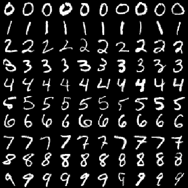
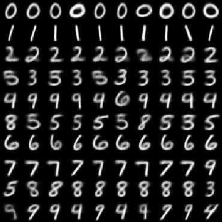
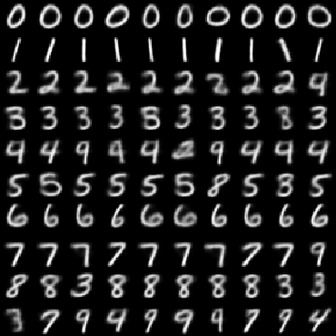
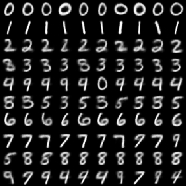
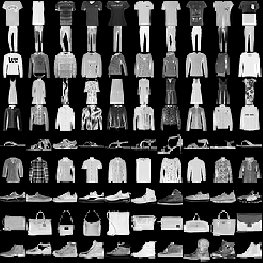
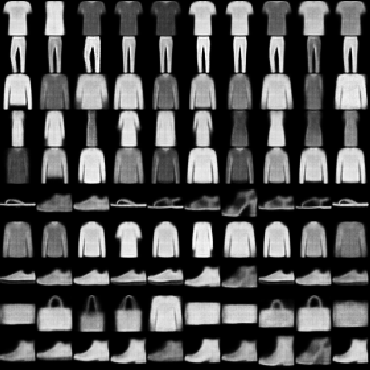
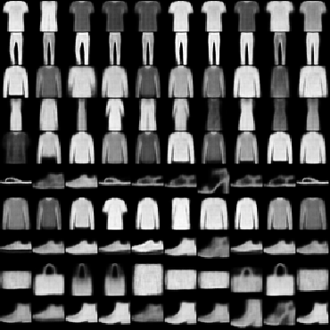
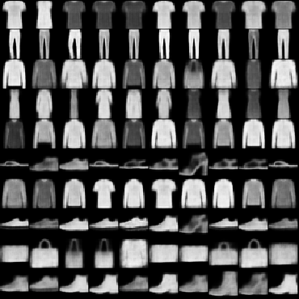

# Variational Auto-Encoders with a VampPrior (tf 2.0)
This repository holds an implementation of a convolutional variational auto-encoder (VAE) and a convolutional hierarchical variational auto-encoder (HVAE) each with a "variational mixture of posteriors" prior (VampPrior) following the paper:
* [VAE with a VampPrior](https://arxiv.org/abs/1705.07120) Jakub M. Tomczak, Max Welling, 2018.

## Models
A VAE reduces an input image to a lower-dimensional latent representation and reconstructs the input image from the latent representation. As the model is forced to prioritize on certain aspects of the data, it often learns useful representations and ignores noise.

## Results
### MNIST
The following results can be reproduced by running the command:
```
python train.py --latent_dim 2 --model <vae or hvae> --prior <standard or vamp> --network_size 16
```
#### Reconstruction
<table align="center">
<tr align='center'>
<td> Input image </td>
<td> VAE </td>
<td> VAE-VAMP </td>
<td> HVAE </td>
<td> HVAE-VAMP </td>
</tr>
<tr>
<td>
<td>
<td>
<td>
<td>
</tr>
</table>

#### Latent Space
<table align="center">
<tr align='center'>
<td> VAE </td>
<td> VAE-VAMP </td>
<td> HVAE </td>
<td> HVAE-VAMP </td>
<tr>
<td>
<td>
<td>
<td>
</tr>
</table>

#### Training and validation loss history


### Fashion MNIST
The following results can be reproduced by running the command:
```
python train.py --latent_dim 2 --model <vae or hvae> --prior <standard or vamp> --data_set fashionmnist --network_size 16
```
#### Reconstruction
<table align="center">
<tr align='center'>
<td> Input image </td>
<td> VAE </td>
<td> VAE-VAMP </td>
<td> HVAE </td>
<td> HVAE-VAMP </td>
</tr>
<tr>
<td>
<td>
<td>
<td>
<td>
</tr>
</table>

#### Latent Space
<table align="center">
<tr align='center'>
<td> VAE </td>
<td> VAE-VAMP </td>
<td> HVAE </td>
<td> HVAE-VAMP </td>
<tr>
<td>
<td>
<td>
<td>
</tr>
</table>

#### Training and validation loss history


## Usage
### Requirements
The code is compatible with:
* `tensorflow 2.0`
* `numpy`
* `matplotlib`


### Arguments
*Optional* :  
* `--model`: Type of variational autoencoder: [`vae`, `hvae`]. *Default*: `vae`
* `--prior`: Type of prior: [`standard`, `vamp`]. *Default*: `standard`
* `--lr`: Learning rate. *Default*: `1e-4`
* `--epochs`: Number of train set run-throughs. *Default*: `250`
* `--batch_size`: Batch size for SGD. *Default*: `256`
* `--data_set`: Data set: [`mnist`, `fashionmnist`] *Default*: `mnist`
* `--latent_dim`: Dimension of the latent space or bottleneck. *Default*: `2`
* `--network_size`: Factor that determines the number of filters. *Default*: `4`
* `--activation`: Activation function. *Default*: `relu`
* `--gs_key`: Grid search key for saving of results and images. *Default*: `None`

## References
[1] https://github.com/jmtomczak/vae_vampprior  
[2] https://www.tensorflow.org/tutorials/generative/cvae  
[3] https://github.com/hwalsuklee/tensorflow-mnist-VAE